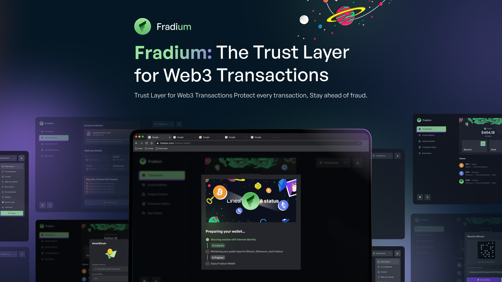
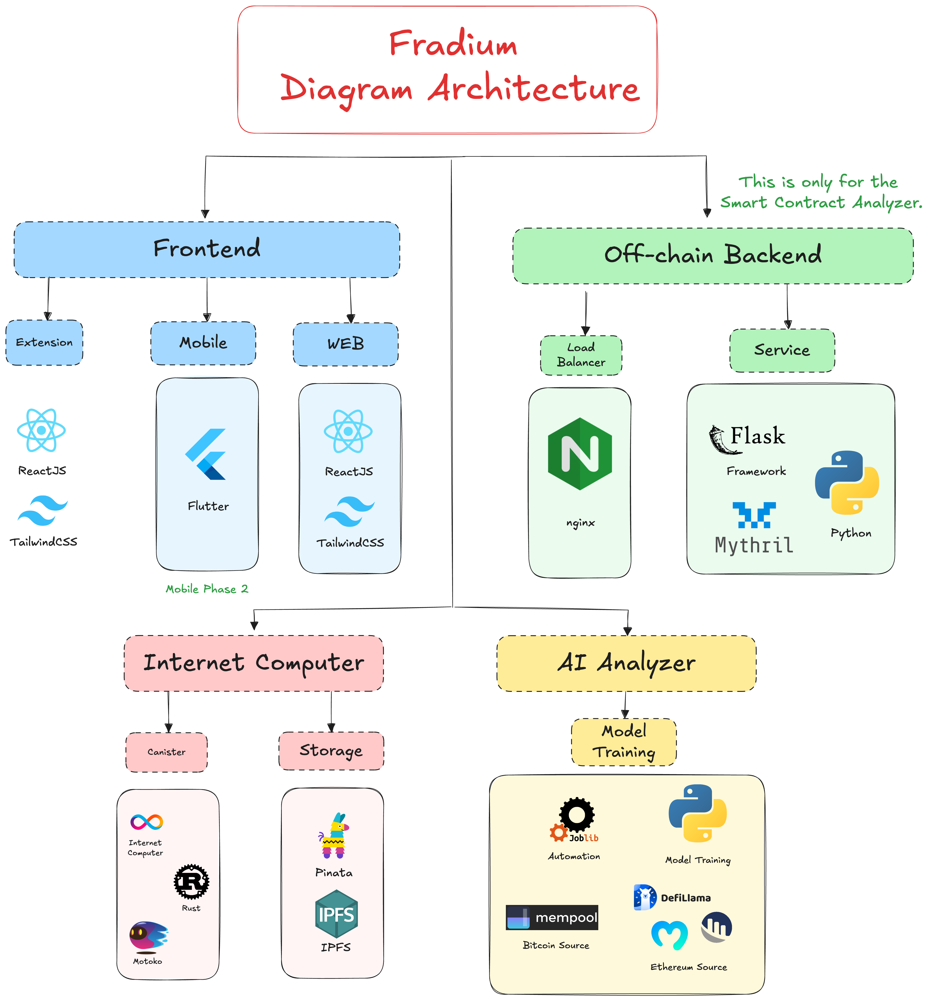
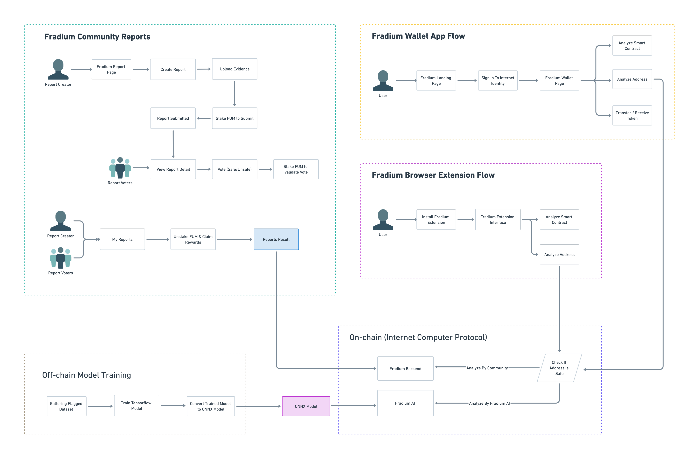

# 🌟 Fradium

<br />
<div align="center">
  <a href="https://github.com/fradiumofficial/fradium">
    
  </a>

  <h3 align="center">Fradium – The Trust Layer for Web3 Transactions</h3>
<p align="center">
   Fradium is a security and analytics platform built fully onchain and designed to work seamlessly across multiple blockchain networks including Bitcoin, Ethereum, Solana, Internet Computer, and others network., Fradium enables real-time address analysis, transaction insights, and threat detection across different ecosystems.

The platform provides a complete set of tools including a decentralized wallet app, browser extension, and community-driven reporting system. Users can analyze, report, and transact with greater confidence. Suspicious addresses are identified through AI models trained on high-quality datasets, and results are continuously improved through community contributions and verified reports. With token incentives and transparent voting, Fradium empowers users to actively participate in securing the Web3 space.

</p>

</div>

## 📌 Why Fradium?

In the growing world of decentralized finance, users interact with thousands of blockchain addresses and smart contracts every day, many of which may be unverified, anonymous, or even malicious. Traditional wallets and explorers offer limited protection or context, putting users at risk of fraud, scams, and security breaches. Fradium addresses this challenge by providing a secure, AI-powered platform with community-backed reports to detect threats in real time. Supporting multiple blockchains, Fradium enables users to analyze, report, and transact safely across networks with confidence. Every transaction is checked before execution, giving users full protection and peace of mind as they navigate Web3.

## 📚 Complete Resources

- Mainnet: https://t4sse-tyaaa-aaaae-qfduq-cai.icp0.io
- Video Demo: https://youtu.be/ojrI1sVdQl0
- Pitch Deck: https://drive.google.com/file/d/1WuzlsoFHoZEb9zIQQohGaBz3mQPe8f2B/view?usp=sharing
- Docs: https://fradium.gitbook.io/docs

## 🌟 Features of Fradium

### Fradium Wallet App (Cross-Chain & On-Chain)

- Manage multiple blockchain assets in a single interface.
- Supports major networks like Bitcoin, Ethereum, Solana, and ICP.
- Wallet addresses are generated on-chain with secure identity binding.
- Send and receive tokens across supported networks.
- Each recipient address is analyzed in real time before sending.
- Transaction History & Scan Logs

### Fradium Browser Extension

- Companion tool for secure interaction on Web3 platforms.
- Analyze addresses and/or ethereum smart contract directly from your browser before confirming transactions.
- Works seamlessly with dApps, wallets, and explorers.

### Multi-Chain Analytics Engine (AI onchain detection)

- Fradium AI detects threats using high-quality, evolving datasets.
- Analyzes address behavior across chains in real time.
- Continuously improved through community and machine learning feedback.

### Fradium Community Report

- Report suspicious addresses and review reports from others.
- Submit supporting evidence to back your report.
- Earn $FUM tokens through voting and contribution validation.
- Voting & Governance (Proof of Credible Contribution - PoCC)
- Stake your tokens and vote on submitted reports.
- Contributions are publicly tracked and rewarded.

### $FUM Token System

- Utility and governance token within the Fradium ecosystem.
- Used for staking, voting, and rewarding credible reports.
- All token actions are handled securely on-chain.

## 🏆 What We Are Proud Of

- Successfully developed Chain Fusion engine enabling seamless cross-chain transactions across Bitcoin, Ethereum, Solana, ICP, and more.
- ONNX AI model runs fully on-chain for real-time threat detection.
- LLM successfully deployed in canister for on-chain AI interaction.
- Secure login with Internet Identity integration.
- Fully on-chain community reporting and voting system.
- Developed custom $FUM token supporting ICRC-1 and ICRC-2 for staking, voting, and contributor rewards.

## Buiild and Run Yourself

### Prerequisites

- [ ] Install the [IC SDK](https://internetcomputer.org/docs/current/developer-docs/setup/install/index.mdx) v0.27.0. If the IC SDK is already installed with an old version, install 0.27.0 with [`dfxvm`](https://internetcomputer.org/docs/building-apps/developer-tools/dev-tools-overview#dfxvm).
- [ ] Confirm the IC SDK has been installed with the correct version with `dfx --version`.
- [ ] On **macOS**, an `llvm` version that supports the `wasm32-unknown-unknown` target is required. This is because the `zstd` crate (used, for example, to decode `base64+zstd`-encoded responses from Solana's [`getAccountInfo`](https://solana.com/de/docs/rpc/http/getaccountinfo)) depends on LLVM during compilation. The default LLVM bundled with Xcode does not support `wasm32-unknown-unknown`. To fix this, install the [Homebrew version](https://formulae.brew.sh/formula/llvm), using `brew install llvm`.

Begin by opening a terminal window.

### Install MOPS

[Install](https://docs.mops.one/quick-start#2-install-mops-cli) the MOPS package
manager, e.g., by running

```bash
curl -fsSL cli.mops.one/install.sh | sh
```

### Install cargo:

```sh
curl https://sh.rustup.rs -sSf | sh
```

### Install Bitcoin Locally with Regtest

Fradium includes Bitcoin functionality. For testing and development, you can run a local Bitcoin regtest instance, allowing you to mine blocks instantly, issue fake BTC, and test transfers securely.

To set up your local Bitcoin regtest environment, follow this official guide:

👉 [Install bitcoin on local machine](https://internetcomputer.org/docs/build-on-btc/btc-dev-env)

The guide walks you through:

- Installing bitcoind
- Creating bitcoin.conf and bitcoin_data directory
- Running bitcoind

Once bitcoind is running successfully on your local machine, you can proceed to set up and deploy the application.

### Setup Application:

- Start local Internet Computer replica

  ```sh
   cd fradium/
   dfx start --clean --background
  ```

- Deploy applications

  ```sh
   dfx deploy
  ```

- Run build fradium token script

  ```sh
   chmod +x ./scripts/build.fradium_token.sh
   ./script/build.fradium_token.sh
  ```

## Architecture Diagram



## User Flow Diagram



## 🛣️ Fradium Roadmap

### 🧱 Phase 1 – Ecosystem Foundation

- Launch **browser extension** for address analysis and transaction safety
- Develop and deploy **Web Wallet App** with **Solana** and **Bitcoin** transaction support
- Deploy **community-driven reporting system** with voting and contribution tracking
- Launch **$FUM token** with full **ICRC-1** and **ICRC-2** standard support
- Release browser extension on **Chrome Web Store** and **Firefox Add-ons**
- Integrate **AI detection** for **Ethereum** and **Bitcoin** address analysis

### 🌍 Phase 2 – Expanding Accessibility

- Develop **cross-platform mobile wallet** using Flutter (**Android & iOS**)
- Enable **Ethereum transaction support** and **ERC20 token** management
- Add **SPL token** support for Solana (e.g., **USDC**, **USDT**)
- Expand **AI detection** to support **Solana** address analysis

### 🔗 Phase 3 – Full Multi-Chain Experience

- Launch **integrated browser extension wallet** for unified user experience
- Enable full support for **ICP native tokens** including `ckBTC`, `ckETH`, `ckUSDC`, and other **chain-key assets**

### 🏛️ Phase 4 – Decentralized Governance & Advanced Integration

- Integrate Fradium into the **SNS (Service Nervous System)** for decentralized protocol ownership and governance
- Begin research and prototyping for **Fradium SDK/API** to allow third-party apps to access our **AI** and **security tools**

## Created by Fradium Team

- Wildan Syukri Niam (Frontend Developer)
- Gavin Indra Alinski (Blockchain Developer)
- Ghina Rosvita Maharani (UI/UX Designer)
- Arga Adolf Lumunon (AI Engineer)
- Yazid Al Ghozali (Extension Developer)
